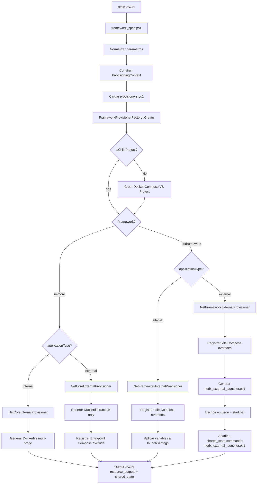

# Framework Provisioning Flow

## Leyenda

**shared_state.commands:**
- Array de comandos shell que se devuelven en el JSON de salida
- **.NET Core External**: comandos de merge compose para entrypoint override
- **.NET Framework Internal**: comandos de merge compose para idle debugging (implícito)
- **.NET Framework External**: comandos de merge compose + launcher script

**Docker Compose VS Project:**
- Se crea **solo para Parent Projects** (cuando `IsChildProject == false`)
- Se ejecuta **una vez** antes de evaluar framework/applicationType
- Incluye: crear `.dcproj`, descargar plantillas, registrar en `.sln`

**Idle Compose:**
- Solo para **.NET Framework** (interno y externo)
- Genera `idle-{workload}.yaml` con SDK override
- Registra comandos `debbugeable_net_framework.ps1` para merge (implícito)

**Dockerfiles:**
- **NetCore Interno**: Multi-stage (build + runtime-exe + runtime-iis)
- **NetCore Externo**: Runtime-only (aspnet/runtime según hostingModel)
- **NetFramework**: No genera Dockerfile (usa idle compose + Visual Studio)
