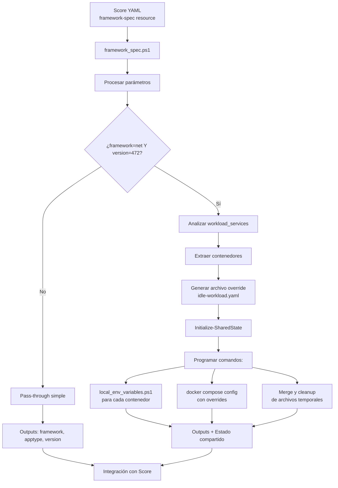

# Framework Provisioner

Este documento describe el funcionamiento detallado del Framework Provisioner, un provisioner especializado incluido en [Score Provisioners](./README.md).

## Información General

- **Tipo**: `framework`
- **URI**: `cmd://pwsh`
- **Script**: `framework_spec.ps1`
- **Descripción**: Provisioner especializado para configuraciones de framework con lógica específica para .NET Framework 4.7.2

## 🔧 Funcionamiento Interno

Este provisioner tiene dos comportamientos principales dependiendo de la configuración de framework:

### 1. Comportamiento General
- Recibe y procesa parámetros de framework, tipo de aplicación y versión
- Devuelve estos mismos valores como outputs para que otros provisioners los usen
- Actúa como un repositorio de metadatos sobre la tecnología utilizada

### 2. Lógica Especial para .NET Framework 4.7.2
Cuando detecta `framework="net"` y `version="472"`, activa un flujo especial:

- **Análisis de Contenedores**: Examina todos los contenedores definidos en el workload actual
- **Generación de Overrides**: Crea archivos temporales de Docker Compose que deshabilitan contenedores específicos
- **Comandos de Post-Procesamiento**: Programa la ejecución de scripts adicionales después de la generación
- **Gestión de Variables**: Invoca `local_env_variables.ps1` para extraer variables de entorno del compose generado

### 3. Script local_env_variables.ps1
Este script auxiliar se encarga de la persistencia de variables de entorno:

- **Extracción**: Lee el archivo `compose.yaml` generado y extrae todas las variables de entorno de un servicio específico
- **Persistencia**: Guarda estas variables en el sistema Windows (scope User, Machine o Session)
- **Formato**: Convierte variables del formato `KEY=VALUE` a `SERVICENAME_KEY=VALUE`
- **Gestión Inteligente**: Solo actualiza variables que han cambiado, evitando sobrescrituras innecesarias

## 📋 Casos de Uso Especializados

- **Legacy .NET Framework**: Manejo especial para aplicaciones .NET Framework 4.7.2
- **Gestión de Variables de Entorno**: Extracción automática de variables desde compose.yaml al sistema
- **Contenedores Idle**: Capacidad de deshabilitar contenedores específicos según configuración
- **Merge de Configuraciones**: Combinación dinámica de archivos compose para configuraciones complejas
- **Persistencia de Variables**: Variables de entorno persisten entre sesiones de PowerShell

## Parámetros Soportados

| Parámetro | Tipo | Descripción | Ejemplo |
|-----------|------|-------------|---------|
| `framework` | string | Tipo de framework | "net", "java", "node" |
| `apptype` | string | Tipo de aplicación | "web", "api", "runtime" |
| `version` | string | Versión del framework | "472", "8.0" |

## Outputs Generados

| Output | Descripción |
|--------|-------------|
| `framework` | Tipo de framework (pass-through) |
| `apptype` | Tipo de aplicación (pass-through) |
| `version` | Versión del framework (pass-through) |

## Flujo de Trabajo del Framework Provisioner



## Ejemplo de Uso

```yaml
apiVersion: score.dev/v1b1
metadata:
  name: mi-app-framework
spec:
  containers:
    app:
      image: mi-imagen:latest
  resources:
    # Framework general (pass-through)
    framework-info:
      type: framework
      params:
        framework: "java"
        apptype: "api"
        version: "17"
    
    # .NET Framework 4.7.2 (lógica especial)
    net-framework:
      type: framework
      params:
        framework: "net"
        apptype: "web"
        version: "472"
```

## Comportamiento Especial para .NET Framework 4.7.2

Cuando se detecta la combinación `framework="net"` y `version="472"`, el provisioner:

1. **Analiza el workload actual** para identificar todos los contenedores definidos
2. **Genera archivos override** que deshabilitan contenedores específicos
3. **Programa scripts post-generación** para:
   - Extraer variables de entorno con `local_env_variables.ps1`
   - Ejecutar `docker compose config` con overrides
   - Hacer merge y cleanup de archivos temporales

### Variables de Entorno Persistentes

El script `local_env_variables.ps1` maneja la persistencia automática:

```powershell
# Variables extraídas del formato:
# KEY=VALUE

# Se convierten a:
# SERVICENAME_KEY=VALUE

# Y se persisten en el sistema Windows
```

## Scripts Relacionados

- `framework_spec.ps1`: Script principal del provisioner
- `local_env_variables.ps1`: Gestión de variables de entorno persistentes
- `Initialize-SharedState`: Manejo del estado compartido entre provisioners

## Referencias

- [Documentación principal de Score Provisioners](./README.md)
- [Documentación de Score](https://score.dev/docs)
- [Score Compose Documentation](https://docs.score.dev/docs/score-implementation/score-compose/)
- [Provisioners Guide](https://docs.score.dev/docs/score-implementation/score-compose/provisioners/) 