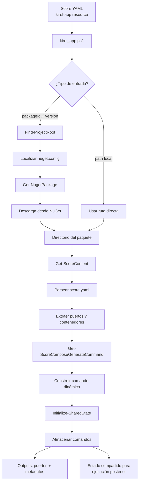

# Kirol App Provisioner

Este documento describe el funcionamiento detallado del Kirol App Provisioner, uno de los provisioners avanzados incluidos en [Score Provisioners](./README.md).

## Información General

- **Tipo**: `kirol-app`
- **URI**: `cmd://pwsh`
- **Script**: `kirol_app.ps1`
- **Descripción**: Provisioner avanzado para gestión de aplicaciones Kirol con descarga automática de paquetes NuGet

## 🔧 Funcionamiento Interno

Este provisioner maneja aplicaciones Kirol a través de un flujo complejo que combina descarga de paquetes NuGet con análisis de configuraciones Score:

### 1. Localización del Proyecto
- Busca el archivo `nuget.config` desde el directorio raíz del proyecto (identificado por archivos `.sln`)
- Esto permite usar fuentes NuGet personalizadas y configuraciones específicas del proyecto

### 2. Gestión de Paquetes
- Si recibe `packageId` y `packageVersion`, descarga el paquete desde NuGet usando la configuración encontrada
- Si recibe `path`, utiliza directamente esa ruta local
- Crea directorios necesarios y maneja errores de descarga

### 3. Análisis de Score
- Lee el archivo `score.yaml` del paquete/proyecto usando el módulo PowerShell-YAML
- Extrae información sobre contenedores, puertos y configuraciones
- Convierte la configuración YAML en estructuras PowerShell manipulables

### 4. Generación de Comandos
- Construye dinámicamente comandos `score-compose generate` con parámetros específicos
- Incluye configuraciones de build para cada contenedor encontrado
- Almacena estos comandos en el estado compartido para ejecución posterior

### 5. Estado Compartido
- Mantiene un estado global que persiste entre provisioners
- Almacena comandos que deben ejecutarse después de la fase de provisioning
- Permite coordinación entre múltiples provisioners

## 📋 Casos de Uso Avanzados

- **Microservicios Kirol**: Descarga automática de paquetes de aplicaciones desde repositorios NuGet privados
- **Gestión de Dependencias**: Resolución automática de dependencias entre aplicaciones Kirol
- **Despliegue Multi-Proyecto**: Coordinación de múltiples aplicaciones Kirol en un solo compose
- **Configuración Dinámica**: Lectura de configuraciones desde paquetes NuGet y aplicación automática

## Parámetros Soportados

| Parámetro | Tipo | Descripción |
|-----------|------|-------------|
| `packageId` | string | ID del paquete NuGet a descargar |
| `packageVersion` | string | Versión específica del paquete |
| `downloadPath` | string | Ruta de destino para la descarga |
| `path` | string | Ruta alternativa a un proyecto local (en lugar de NuGet) |

## Outputs Generados

| Output | Descripción |
|--------|-------------|
| `ports` | Puertos extraídos del score.yaml |
| `containers` | Información de contenedores |
| `metadata` | Metadatos del proyecto |

## Flujo de Trabajo del Kirol App Provisioner



## Ejemplo de Uso

```yaml
apiVersion: score.dev/v1b1
metadata:
  name: mi-app-kirol
spec:
  containers:
    app:
      image: mi-imagen:latest
  resources:
    # Descarga de paquete NuGet
    kirol-package:
      type: kirol-app
      params:
        packageId: "MiPaquete.Kirol"
        packageVersion: "1.0.0"
        downloadPath: "./packages"
    
    # Proyecto local
    kirol-local:
      type: kirol-app
      params:
        path: "./mi-proyecto-kirol"
```

## Scripts Relacionados

Este provisioner utiliza varios scripts PowerShell auxiliares:

- `Find-ProjectRoot`: Localiza la raíz del proyecto basándose en archivos `.sln`
- `Get-NugetPackage`: Descarga paquetes NuGet usando configuraciones personalizadas
- `Get-ScoreContent`: Parsea archivos score.yaml usando PowerShell-YAML
- `Get-ScoreComposeGenerateCommand`: Construye comandos dinámicos para score-compose
- `Initialize-SharedState`: Gestiona el estado compartido entre provisioners

## Referencias

- [Documentación principal de Score Provisioners](./README.md)
- [Documentación de Score](https://score.dev/docs)
- [Score Compose Documentation](https://docs.score.dev/docs/score-implementation/score-compose/) 